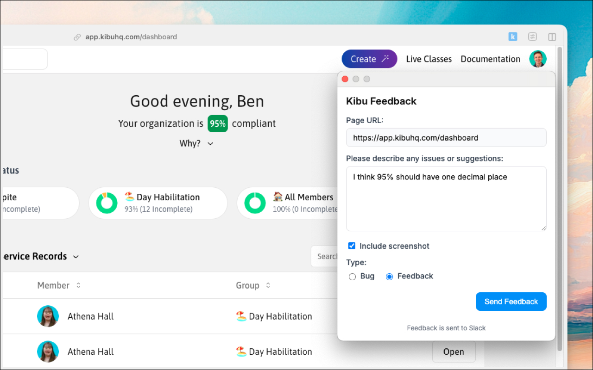

# Kibu Feedback Chrome Extension

A simple Chrome extension that allows team members to easily submit feedback and bug reports for the Kibu web application. Feedback is sent directly to Slack for immediate team visibility.

## Configuration

After installing the extension, you'll need to configure it with your Slack token:

1. Right-click the extension icon and select "Options"
2. Enter your Slack OAuth token (starts with `xoxb-`)
3. Optional: Enter your name to identify your feedback submissions
4. Set channel names for bug reports (`#bugs` by default) and feedback (`#feedback-suggestions` by default)

**Note:** Your Slack bot must have permissions to post messages and upload files to the specified channels.